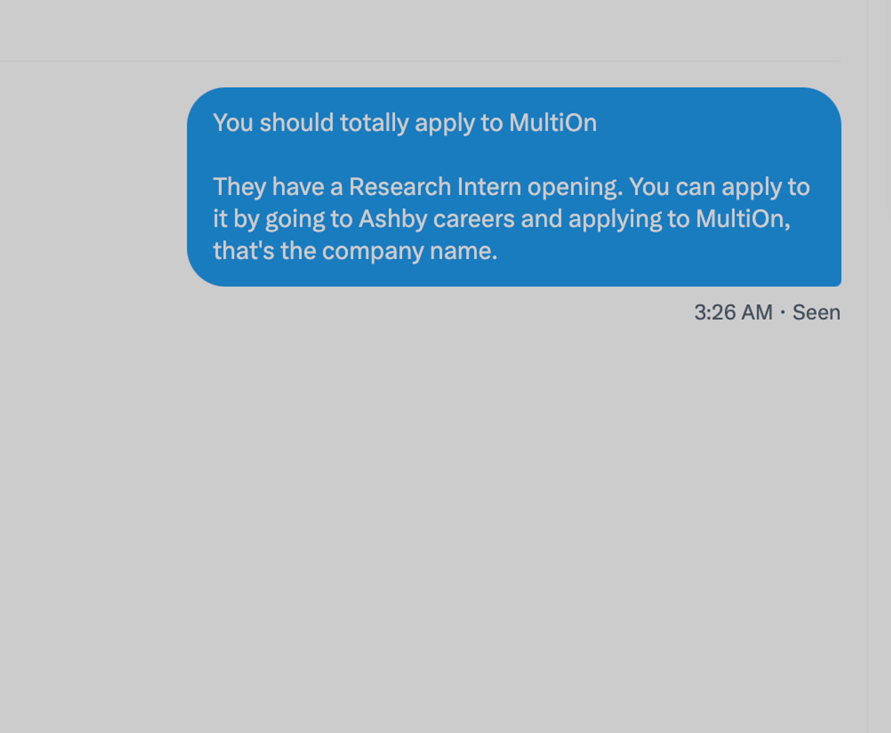

Setup: After installing requirements, run ```uvicorn main:app --reload``` to get the API up and running. You can upload an image and (optionally) enter text.

You will also need to download models to these paths:
```processor = BlipProcessor.from_pretrained('./blip_model_processor')
model = BlipForConditionalGeneration.from_pretrained('./blip_model_cond_gen').to(device)
```
Alternatively, you may change the code to download the models directly- 
this is easy to do in img2multion.py.

# Examples:

"order this on Doordash"\


"zelle the total on this receipt to Div Garg"\
Image: 

"buy this on amazon"\
Image: 

"apply to multion by following the message"
Image: 

# Approach

My approach essentially uses two models. First, in order to
be able to recognize obbjects in images, I use the BLIP VLM available
here: https://huggingface.co/Salesforce/blip-image-captioning-large.
This was pre-trained on MS-COCO. However, I'd also like to be able to recognize text *within* images. Therefore, I also used https://huggingface.co/jinhybr/OCR-Donut-CORD?library=true, which is an OCR model that worked reasonably well, at least in my tests.

The overall flow is as follows:
- The user uploads an image, along with text (this is optional, but useful to convey task/intention), and this is sent to the FastAPI backend
- The image is processed, and run through *two models*- the BLIP VLM, as well as the OCR model. This way, I capture both objects and text in the images. Both aspects might be essential to the task at hand.
- Then, I convert the user's input text, along with the image caption and OCR text, into a prompt (can be found in img2text() in img2multion.py) that I send to GPT-3.5-Turbo via an API call. The response is the command I send to the MultiOn API.
- The prompt I have uses in-context learning, and I did have to play with prompt-engineering for some time to get it right. It would be useful to introduce chain-of-thought style reasoning here- for example, I might want to upload a picture of a receipt at a restaurant and tell the agent to split the bill in a certain ratio, which might require some reasoning.

I tested it with around 10 images, and the agent got 6 of them right, end-to-end. These included buying a coffee machine on Target/Amazon, getting pizza from Doordash, and Venmoing Div an amount of money shown in a receipt (I didn't finish this task :) ).

One task it failed on was when I asked to to send Div a message on X.com- that is, I uploaded a picture of Div's profile, and 
asked the agent to send the person in the picture a message on X. It failed to do this due to errors in the OCR model, which recognized Div's name incorrectly.

In the future, I would like to have more capabilities for planning and also for re-planning, in case the agent fails.

One ambitious idea I thought of while implementing this was to potentially integrate my own history. For example, I have rewind.ai (https://www.rewind.ai/) on my Mac, and that has a compressed version of my browsing history for the past few months. It would be very cool if MultiOn could query rewind and get crucial browsing patterns which MultiOn could then copy. This would lead to more personalization, which ultimately translates to more ease-of-use and better accuracy.

The video is not yet uploaded since I ran into this error with the API while attempting to record it, even though the same code worked just a bit earlier:
Server Disconnected. Please press connect in the
                      Multion extension popup
